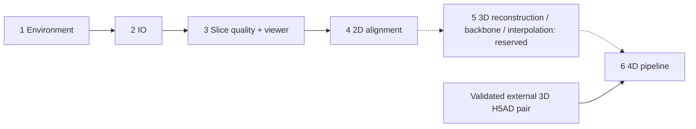

# Spateo Skills

An ordered Spateo skill collection from environment setup and data IO through slice QC, 2D alignment and native cross-timepoint 4D analysis, with a reserved 3D workflow stage.

[中文说明](README.zh-CN.md)

## Ordered workflow

| Order | Entrypoint | Scope and handoff | Status |
| --- | --- | --- | --- |
| 1 | [setup-spateo-environment](skills/setup-spateo-environment/SKILL.md) | Prepare/verify a separate native Spateo environment. | Existing |
| 2 | [spateo-data-io](skills/spateo-data-io/SKILL.md) | Contract-based spatial reading → named AnnData outputs and diagnostics. | Rewritten in English for current IO |
| 3 | [spatial-slice-quality-qc](skills/spatial-slice-quality-qc/SKILL.md) | Slice QC → keep/exclude evidence; includes [slice-quality-viewer](skills/spatial-slice-quality-qc/subskills/spatial-slice-quality-viewer/SKILL.md). | Existing runtime, viewer nested here |
| 4 | [spateo-2d-alignment](skills/spateo-2d-alignment/SKILL.md) | Serial 2D alignment → aligned sections, QC, replay and provenance. | Existing two pipelines and 14 subskills |
| 5 | [spateo-3d-pipeline](skills/spateo-3d-pipeline/SKILL.md) | 3D model reconstruction → backbone analysis and gene interpolation. | Reserved; no executable implementation |
| 6 | [spateo-4d-pipeline](skills/spateo-4d-pipeline/SKILL.md) | Cross-timepoint 3D alignment → morphogenesis → tracked outputs/dashboard. | Rewritten in English for native runtime |



There are **six top-level entrypoints**, including the intentionally reserved 3D stage; **26 SKILL.md files** in total. The five 4D companions live under `spateo-4d-pipeline/subskills/`: align-stages, morphogenesis, manage-runs, refine-analysis and render-dashboard. The QC viewer belongs inside the QC directory. Install each complete top-level directory; parent entrypoints route to nested companions without requiring automatic recursive discovery.

```text
skills/
├── setup-spateo-environment/
├── spateo-data-io/
├── spatial-slice-quality-qc/
│   └── subskills/spatial-slice-quality-viewer/
├── spateo-2d-alignment/
│   ├── pipelines/{pairwise-rigid,continuity-guided}/
│   └── subskills/  (14 companions)
├── spateo-3d-pipeline/  (reserved)
└── spateo-4d-pipeline/
    ├── scripts/  (shared native runtime)
    └── subskills/  (5 companions)
```

The library is a separate checkout, not this skills repository. IO and 4D are verified against [Spateo commit 615644f](https://github.com/gmhhhhhh-929/spateo-release/tree/615644f88613bea8ceb2e2df1e2391d16de55ec1). The [protocol migration](skills/spateo-4d-pipeline/references/protocol-migration.md) records how the user's existing notebooks map to current APIs. Existing environment and 2D runtime snapshots retain their documented historical provenance; this update does not claim those frozen algorithms were rewritten.

## Alignment pipelines

Both pipelines belong to the **2D alignment skill**. Both accept verified shared expression PCA, annotation one-hot, or spatial-only input.

| Pipeline | Use | Source snapshot |
| --- | --- | --- |
| `pairwise-rigid` | Adjacent rigid Spateo alignment. | Previously identified as v0.2.3. |
| `continuity-guided` | Serial Spateo alignment with automatic continuity checks and optional repairs. | Derived from the v3.7.0 snapshot, with explicit representation and profile controls. |

For continuity-guided, **`--profile legacy` remains the default**. The optional `--profile generalized` disables nearest-neighbor initialization and replaces the named-tissue priority with anonymous supported-label proposals. Frozen validation found average Drosophila improvements, Planarian regressions and severe individual failures. It does not establish a generally better profile. See [accuracy and validation limits](skills/spateo-2d-alignment/references/validation.md).

Historical version identifiers, source hashes and subsequent implementation changes are recorded in the [migration manifest](skills/spateo-2d-alignment/provenance/source_migration.json).

## Use

Clone this repository and let your agent read the relevant `SKILL.md`. Copy the desired top-level skill directory into your configured skill directory. For alignment, copy all of `spateo-2d-alignment/`, including `subskills/`; use its main entrypoint to access the nested workflows.

```text
Use $setup-spateo-environment to prepare and verify a Spateo environment.
Use $spateo-data-io to inspect this dataset and convert it to AnnData.
Use $spateo-2d-alignment to align these ordered tissue slices using shared expression PCA without annotation.
```

Spateo itself is installed from a **separate source checkout** or a compatible environment; this repository contains skills and alignment pipelines, not the complete Spateo library. The environment skill documents the required checkout and installation commands.

Data IO preserves the meaning of counts, annotations, spatial coordinates, units, and cell identifiers. It does not establish registration or silently manufacture an `X_pca`. Follow the alignment input contract and select a representation explicitly.

For expression input, [prepare shared PCA](skills/spateo-2d-alignment/references/expression-pca.md) jointly over all requested slices of **one biological specimen**. The preparer matches cells to the expression source by ID and writes new sanitized slices, `basis.npz`, and `expression_pca_manifest.json`. It never pools species or developmental stages. Both validators require the shared basis and matching per-slice feature, identity and file hashes; matching feature dimensions alone is insufficient. An explicit `--pca-provenance` can select the manifest.

Annotation is not required for expression PCA. In continuity-guided expression or spatial-only mode, annotation QC defaults to `off`, including when labels are present. Use `--annotation-qc provided --annotation-key KEY` only when those labels should participate in QC; missing labels then fail validation. Annotation one-hot mode requires provided labels. With QC off, annotation-dependent proposals are skipped and geometric continuity checks remain available. Physical z is preserved when supplied; otherwise unique numeric SL filenames define order without inventing spacing.

## Sources and verification

See [VALIDATION.md](VALIDATION.md) for executed source, skill and packaging tests and limits, [COMPLETENESS.md](COMPLETENESS.md) for scope, and [NOTICE.md](NOTICE.md) for source attribution. No biological datasets or reference coordinates are distributed.

The current automatic IO contract returns SpatialReadResult and retains every dataset outcome; scored detection APIs are retired. 4D uses Spateo-native normalization, sampling and vector-field operations without Dynamo. Optional GLM/GP results are explicitly enabled and recorded. No biological accuracy or historical notebook equivalence is claimed by synthetic smoke tests.

## Spateo Referee

Install the complete `spatial-slice-quality-qc/` directory, including its nested viewer. Joint-review v2 retains its existing experimental-policy limits and scientific runtime. See [methods and validation](skills/spatial-slice-quality-qc/references/methods.md). The viewer relocation changes packaging and path resolution, not QC thresholds or biological certification.
