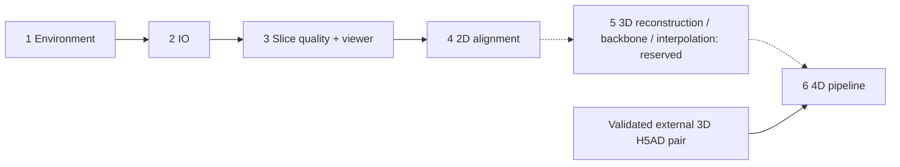

# Spateo Skills

本仓库包含环境配置、Data IO、配准前切片质量筛选、交互证据报告和 2D 切片配准。

[English](README.md)

完整顺序：**环境配置 → IO → 切片质量 QC（包含 viewer）→ 2D 配准 → 3D pipeline（预留）→ 4D pipeline**。

## Ordered workflow

| Order | Entrypoint | Scope and handoff | Status |
| --- | --- | --- | --- |
| 1 | [setup-spateo-environment](skills/setup-spateo-environment/SKILL.md) | Prepare/verify a separate native Spateo environment. | Existing |
| 2 | [spateo-data-io](skills/spateo-data-io/SKILL.md) | Contract-based spatial reading → named AnnData outputs and diagnostics. | Rewritten in English for current IO |
| 3 | [spatial-slice-quality-qc](skills/spatial-slice-quality-qc/SKILL.md) | Slice QC → keep/exclude evidence; includes [slice-quality-viewer](skills/spatial-slice-quality-qc/subskills/spatial-slice-quality-viewer/SKILL.md). | Existing runtime, viewer nested here |
| 4 | [spateo-2d-alignment](skills/spateo-2d-alignment/SKILL.md) | Serial 2D alignment → aligned sections, QC, replay and provenance. | Existing two pipelines and 14 subskills |
| 5 | [spateo-3d-pipeline](skills/spateo-3d-pipeline/SKILL.md) | 3D model reconstruction → backbone analysis and gene interpolation. | Reserved; no executable implementation |
| 6 | [spateo-4d-pipeline](skills/spateo-4d-pipeline/SKILL.md) | Cross-timepoint 3D alignment → morphogenesis → tracked outputs/dashboard. | Rewritten in English for native runtime |



There are **six top-level entrypoints**, including the intentionally reserved 3D stage; **26 SKILL.md files** in total. The five 4D companions live under `spateo-4d-pipeline/subskills/`: align-stages, morphogenesis, manage-runs, refine-analysis and render-dashboard. The QC viewer belongs inside the QC directory. Install each complete top-level directory; parent entrypoints route to nested companions without requiring automatic recursive discovery.

```text
skills/
├── setup-spateo-environment/
├── spateo-data-io/
├── spatial-slice-quality-qc/
│   └── subskills/spatial-slice-quality-viewer/
├── spateo-2d-alignment/
│   ├── pipelines/{pairwise-rigid,continuity-guided}/
│   └── subskills/  (14 companions)
├── spateo-3d-pipeline/  (reserved)
└── spateo-4d-pipeline/
    ├── scripts/  (shared native runtime)
    └── subskills/  (5 companions)
```

The library is a separate checkout, not this skills repository. IO and 4D are verified against [Spateo commit 615644f](https://github.com/gmhhhhhh-929/spateo-release/tree/615644f88613bea8ceb2e2df1e2391d16de55ec1). The [protocol migration](skills/spateo-4d-pipeline/references/protocol-migration.md) records how the user's existing notebooks map to current APIs. Existing environment and 2D runtime snapshots retain their documented historical provenance; this update does not claim those frozen algorithms were rewritten.

## 两套配准 pipeline

两者共同属于第 4 阶段技能，均支持经过审核的共享 expression PCA、注释 one-hot 和 spatial-only 输入。

| 名称 | 功能 | 来源 |
| --- | --- | --- |
| `pairwise-rigid` | 相邻切片的 Spateo 刚性配准。 | 原 v0.2.3 实现。 |
| `continuity-guided` | 连续切片配准，包含自动连续性检查及可选修复。 | 基于原 v3.7.0 快照，增加显式表征类型与 profile 控制。 |

continuity-guided 的兼容默认值仍是 **`--profile legacy`**。显式选择 `--profile generalized` 可关闭最近邻初始化，并用匿名、有支持度的标签候选替代固定组织名称优先级。冻结验证中，果蝇平均指标有所提升，涡虫平均指标下降，部分样本出现明显失败；这些结果不能证明 generalized 普遍更准确或更稳定。详见[准确率与验证边界](skills/spateo-2d-alignment/references/validation.md)。

原版本号、源文件哈希及后续实现修改保留在[迁移记录](skills/spateo-2d-alignment/provenance/source_migration.json)中。

## 使用顺序

1. `$setup-spateo-environment`：准备独立 Spateo 环境。
2. `$spateo-data-io`：按新版 `SpatialReadResult` 契约读取与核验数据。
3. `$spatial-slice-quality-qc`：质量检查、keep/exclude 审计及其内部 viewer。
4. `$spateo-2d-alignment`：在同一生物样本内明确表征与切片顺序后配准。
5. `$spateo-3d-pipeline`：本次只预留重建、backbone、gene interpolation 阶段，未实现。
6. `$spateo-4d-pipeline`：已有可靠 3D H5AD 可直接进入跨时间点配准、形态发生、运行记录与展示。

IO 和 4D 的 skill、配套参考文档及可执行入口已使用英文重写。测试和限制见 [VALIDATION.md](VALIDATION.md)。

## 无注释的表达 PCA 输入

准备器按细胞 ID 对应原始表达矩阵，为**同一个生物样本的全部待配准切片**联合计算一次 PCA。它不混合不同物种或发育时期，也不分别为每张切片拟合不同基底。以下命令从仓库根目录运行，示例中的输入路径需换成实际文件，输出目录必须是新目录：

```bash
python skills/spateo-2d-alignment/scripts/prepare_expression_pca.py \
  --slice-dir inputs/specimen_slices \
  --expression-source inputs/specimen_expression.h5ad \
  --matrix-state counts --n-hvg 2000 --n-pcs 50 \
  --output-dir runs/specimen_pca

python skills/spateo-2d-alignment/pipelines/continuity-guided/run.py \
  --stage specimen --slice-dir runs/specimen_pca/slice_h5ad \
  --output-dir runs/specimen_alignment \
  --representation expression-pca --annotation-qc off --profile generalized --device 0
```

该示例显式使用已做完整功能验证的 generalized；它仍是可选方案，不能据此推断准确率优于 legacy。准备器默认不读取或复制注释。输出包括新的 `slice_h5ad/`、`basis.npz` 和 `expression_pca_manifest.json`；两套 pipeline 都审核共同基底、逐片特征、细胞身份及文件哈希，不能仅凭 PCA 列数相同认定输入合格。可用 `--pca-provenance` 显式指定 manifest。

continuity-guided 的 expression-pca 和 spatial-only 模式默认 `--annotation-qc off`，即使存在注释也不自动用于 QC。只有明确需要可靠标签参与检查时，才使用 `--annotation-qc provided --annotation-key KEY`；此时缺失注释会报错。annotation-onehot 模式必须提供注释。关闭注释 QC 后，依赖标签的修复会跳过，几何连续性检查仍可运行。

已有物理 z 会保留；全部切片均无 z 时，使用文件名中唯一的数字 SL 编号确定顺序，不虚构物理间距。表达预处理参数、矩阵状态声明和无 z 输入要求见[共享表达 PCA 说明](skills/spateo-2d-alignment/references/expression-pca.md)。
